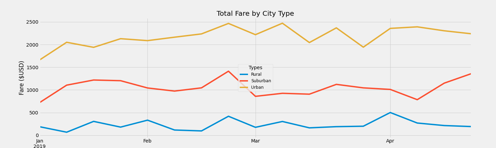

# PyBer_Analysis

## Overview
PyBer has a large base of riders in many different cities spanning different urban, suburban and rural cities. In order to better service and expand this large customer base, it's important to compare the experiences riders in differnt cities and cities types have. This analysis was performed on 2019 rider and city data, and a summary of data based on city types and the total weekly fares for each city type were determined. The summary included Number of Rides, Number of Drivers, Total Fares, Average Fare per Ride and Average Fare per Driver and was determined for urban, suburban and rural citites. The total weekly fares for each city type was determined by the total fares earned for every week in 2019.

## Results
### Urban Cities
As seen in the summary of city types table below, urban cities had the most rides with 1,625 rides. By having the most rides, urban cities also had the most drivers available with 59,602 and the highest total fares with $39,854.38. This correlated to the average fares as well with urban cities having the lowest fare per ride with $24.53 and $.67 for the average fares per driver. As seen in the Total Weekly Fares chart below, urban cities as consistently had the highest total weekly fares as well stayingin the range of $1500 and $2500 between Januray and April.

### Suburban Cities
The analysis showed that suburban cities had the second highest rides with 625 rides. This resulted in suburban cities also having the second highest average fares per ride with $30.97 and $19,356.33 for the total fares. Suburban cities also had the second highest total number of drivers with 8,750 and an average fare of $2.26 per driver. The weekly fare totals for suburban cities also stayed consistently the second highest as well staying between $5000 and $1500 during Januray to April.

### Rural Cities
Rural cities had the lowest number of rides with only 125 rides. They also had the lowest number of drivers and total fares with 537 and $4,327.93 respectively. Rural cities had the highest average fares per ride with $34.62 per ride and $8.06 for the average fare per driver. The total weekly fare for rural cities never was over around $500 between January and April.

### Summary of City Types
The summary of city types table can be found in the 62 output in the following file: 
[PyBer Challenge](PyBer_Challenge.ipynb)

### Total Weekly Fares
The Total Weekly Fares graph shown below shows the total weekly fares for January through April Other than one week in February, changes in the total weekly fares don't seem to be correlated between city type.

 ## Summary
 Based on the analysis, the following recommendations can be made 
 - More drivers in rural areas could be beneficial. More drivers could lead to more rides in rural areas which would increase total fares weekly and thus throughout the year. As we can see with the urban areas which have the most drivers, they also have the most total fares and ridesas well.
 - A look at the how ride fares are determined in suburban and rural areas could be helpful. Despite having the two having significantly less rides than urban cities, rural and suburban cities average fares per ride were $6-10 more than urban cities. Higher fares could be leading to riders wanting to ride less in urban and rural cities.
 - Urban cities could have a slight increase in fares in order to help drivers earn more per fare. Urban cities currently have the lowest average fare and weekly fares are consistently high weekly for urban cities, but the average fare for drivers is the lowest for the drivers. An increase in fares could benefit drivers as well as increase already high urban total fares.
